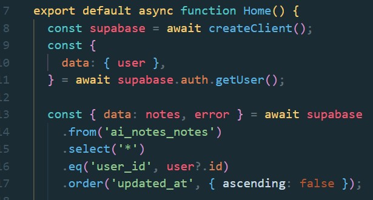
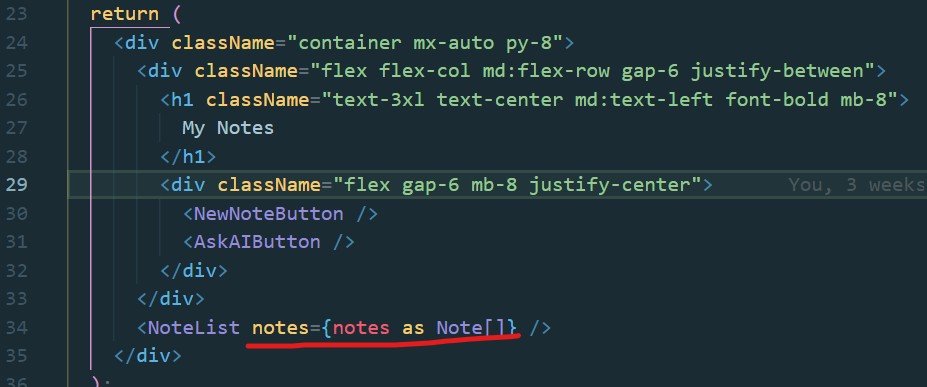
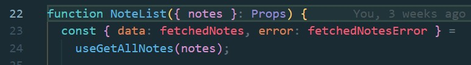
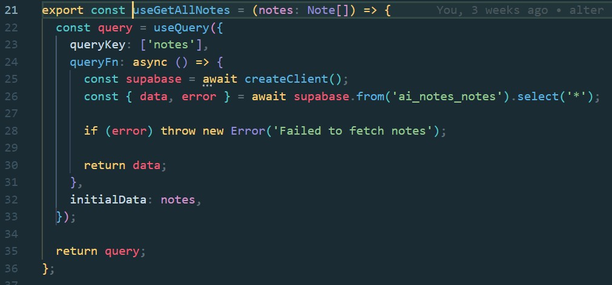
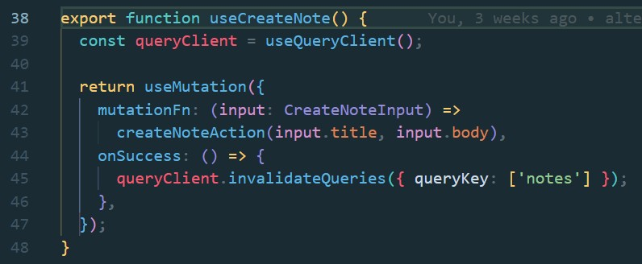
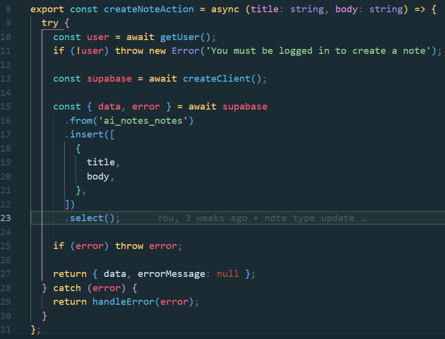

This is a [Next.js](https://nextjs.org) project bootstrapped with [`create-next-app`](https://nextjs.org/docs/app/api-reference/cli/create-next-app).

## Getting Started Locally

First, sign up and create a supabase project, and then add the following to a `.env.local`

```
NEXT_PUBLIC_SUPABASE_URL={SupabaseUrl}
NEXT_PUBLIC_SUPABASE_ANON_KEY={SupabaseAnonKey}
```

Then, run the development server:

```bash
npm run dev
# or
yarn dev
# or
pnpm dev
# or
bun dev
```

Open [http://localhost:3000](http://localhost:3000) with your browser to see the result.

## Stack

- NextJS
- Shadcn and Tailwind
- Supabase
- Tanstack/React Query
- Recharts (for Shadcn charts)

## Data Flow

I believe in granular data invalidation, and at the moment NextJS doesn't provide a straightforward way to invalidate individual calls in the same fashion that ReactQuery does with its `invalidateQueries` method. 

To get around this, I think one of the cleanest solutions is to query data via RSC's on the server, pass said data to client components that themselves initiate a React Query client with initial data. Subsequent calls to `invalidateQueries` can then be applied to individual calls as opposed to entire routes. 

Here's how:

### Data Fetching

- Pages are server rendered with top level `await` calls via a server-side `supabase-js` client

- That data is passed to a client component via props

- That client component calls a hook passing in the data as `initialData`
  - Said hooks are mostly an abstraction around a React Query method

> client component calling hook & passing the initial data


> hook


- Any subsequent call to `invalidateQueries` that includes the `queryKey` provided, data will be refetched client-side

### Mutations

- Mutations are provided via hooks, which wrap server actions that interact with the db server-side
> hook



> action


- The invalidation call within said mutation triggers the refetch in the appropriate client-side queries
- Any given client-side component can call a mutation, which in turn calls a server action, and upon completion it invalidates the appropriate queries client-side. 


